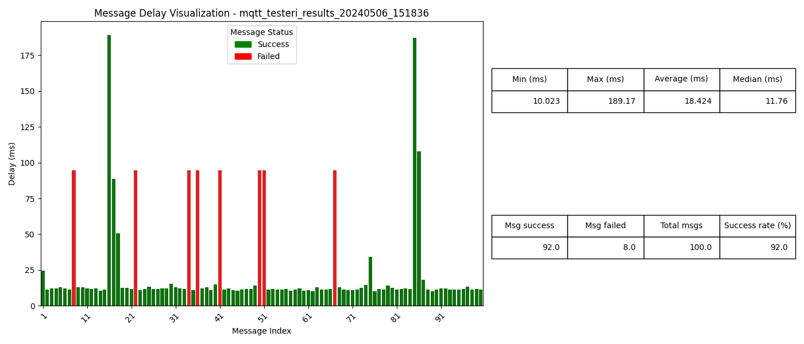

**MQTT LOAD TESTER MANUAL**

**INTRODUCTION**

This manual guides you through setting up and using the MQTT Load Tester, a tool designed for testing MQTT brokers by simulating message traffic. It measures message delays and stores the results in a SQLite database. The tester can be used for both short-term load testing to assess broker performance under specific loads and for long-term testing to measure and analyze delays over extended periods.

**PREREQUISITES**

Ensure you have Python installed on your system (Python 3.6 or newer is recommended). You will also need pip to install Python libraries.

**INSTALLATION**

1. Clone the Repository:
Download the code from the repository or unzip the source code into a directory.

2. Set up Environment:
It's recommended to use a virtual environment:
```bash
python -m venv env
source env/bin/activate  # On Windows use `env\Scripts\activate`
```

**INSTALL DEPENDENCIES**

To ensure the MQTT Load Tester functions properly, the following libraries must be installed. Here’s a breakdown of each library and its installation command:

*Shortcut:*
```bash
pip install paho-mqtt==1.6.1 python-dotenv pandas seaborn matplotlib numpy

```
**paho-mqtt 1.6.1 is the latest stable version at the time of writing this manual.**

*paho-mqtt:* This library provides client functionalities for MQTT protocol, which is essential for MQTT communication between your client and the broker.
```bash
pip install paho-mqtt==1.6.1
```

*python-dotenv:* Dotenv is used to load environment variables from a .env file into your Python script, making it easier to configure your application without hard-coding configurations.
```bash
pip install python-dotenv
```

*pandas:* Pandas is a fast, powerful, flexible and easy to use open source data analysis and manipulation tool, built on top of the Python programming language.
```bash
pip install pandas
```

*seaborn:* Seaborn is a Python visualization library based on matplotlib. It provides a high-level interface for drawing attractive and informative statistical graphics.
```bash
pip install seaborn
```

*matplotlib:* Matplotlib is a comprehensive library for creating static, animated, and interactive visualizations in Python.
```bash
pip install matplotlib
```

*numpy:* Numpy is a fundamental package for scientific computing with Python. It's used extensively in data manipulation and is a dependency for many Python data analysis libraries.
```bash
pip install numpy
```

*sqlite3:* This is a built-in module in Python for working with SQLite databases. It does not require separate installation. This module allows the MQTT Load Tester to store results in a SQLite database efficiently.

*argparse:* Argparse is a built-in module in Python used for handling command-line arguments. Your script can accept various command options using this module, enhancing flexibility and usability without additional installations.

Each library plays a specific role in the setup and execution of the MQTT Load Tester, from managing database operations to rendering visual reports and handling configuration seamlessly.

**CONFIGURATION**

1. Environment Variables:
Configure your MQTT client by setting the values in the .env file. A sample configuration is provided in the source code comments.
2. Database and Reports:
Results are stored in a SQLite database, and visual reports are generated using Python's data visualization libraries. Ensure all prerequisites are met for these components.

*Example .env:*
```bash
MQTT_TESTERI_USERNAME=username
MQTT_TESTERI_PASSWORD=password
MQTT_TESTERI_HOST=mqtt-dev-emq01.company.fi
MQTT_TESTERI_CLIENT_ID=testing-mqtt-explorer
MQTT_TESTERI_TOPIC=name/of/topic/data
MQTT_TESTERI_PROTOCOL=mqtt
MQTT_TESTERI_PORT=8883
MQTT_TESTERI_SSL_ENABLED=True
MQTT_TESTERI_SSL_VERIFY_CERTIFICATE=True
```

*Example result:*


**USAGE**

The load tester accepts several command-line arguments to customize its operation. Below are examples of how to run the tester with different configurations:

*Basic usage:*
```bash
python mqtt_load_tester.py --username [username] --password [password] --host [host address]
```
This command uses the default settings for message configuration: 10 messages at a 1.0-second interval with each message having a string length of 55 characters.

*Verbose Output and Custom Message Configuration:*
```bash
python mqtt_load_tester.py --verbose true --message-count 100 --interval 0.5 --data-string-length 100
```

*Specify SSL and Protocol:*
```bash
python mqtt_load_tester.py --ssl-enabled true --protocol mqtt --port 8883 --ssl-verify-certificate true
```

Note: Replace the placeholders (e.g., [username]) with actual values without the brackets.

**INTERPRETING RESULTS**

Results are stored in the SQLite database with high-resolution timestamps, including datetime information, and message delays. Visual reports are generated as bar charts and summary tables, showing delays and success rates of message deliveries over time.

The inclusion of datetime timestamps enables precise temporal analysis, aiding in the identification of message delivery patterns and potential performance issues across extended testing periods.

**TROUBLESHOOTING**

*Common Issues:*
SSL/TLS configuration errors: Ensure correct ports and SSL settings.
Database locking issues: Confirm that the SQLite database is not being accessed by multiple instances simultaneously.

*Logs:*
Review the logs generated during the operation for error messages or warnings that can provide insights into issues encountered during testing.

**ADDITIONAL RESOURCES**

Paho MQTT Client Documentation: For more in-depth information on using the Paho MQTT client library, visit the official documentation at: https://eclipse.dev/paho/files/paho.mqtt.python/html/client.html

This manual sets the groundwork for efficiently using and troubleshooting the MQTT Load Tester. Adjust the sections according to the specifics of your environment and additional features you may implement.